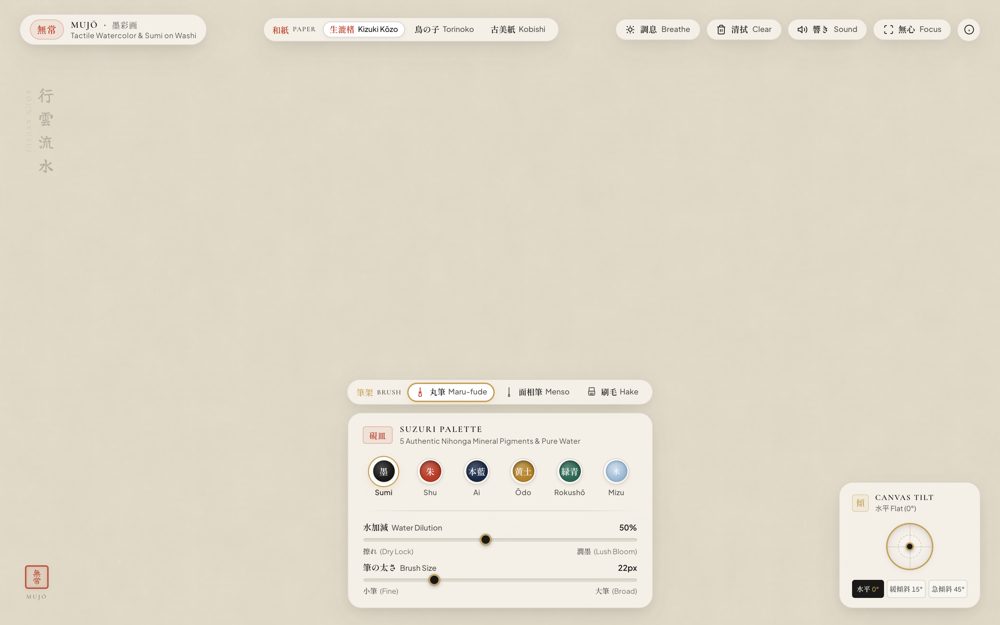
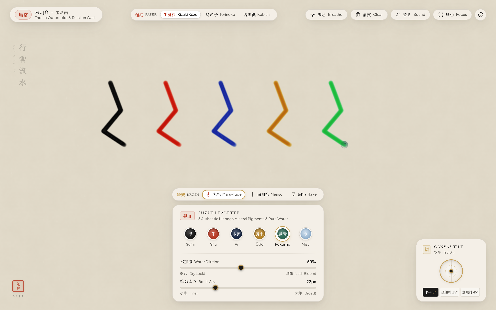
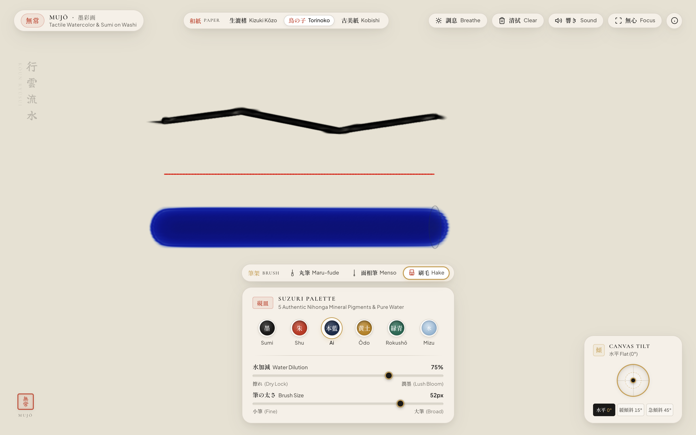

# MUJŌ (無常) — Meditative Watercolor on Washi


A physically-based digital watercolor engine running entirely on WebGPU compute shaders, simulating the ephemeral beauty of Japanese sumi-e ink on handmade washi parchment. Strokes bleed, diffuse through porous fibers, darken along edges, and gradually sublime back to pristine paper.

## Quick Start

```bash
git clone https://github.com/AndrewVoirol/watercolor-workbook.git
cd watercolor-workbook
npm install
npm run dev
```

*Requires Node.js ≥ 18 and a browser with WebGPU support (Chrome 113+, Edge 113+, Safari 18+).*

---

## App States

| Pristine Washi Parchment | 5 Mineral Pigments & Calligraphy | Master Japanese Brushes |
| :---: | :---: | :---: |
|  |  |  |

---

## How It Works

### Interacting with the Canvas
1. **Choose a Master Japanese Brush (筆架 - Fudekake)**:
   - **Maru-fude (丸筆)**: Classic round animal-hair brush for expressive calligraphic tapers, pressure flares, and soft Katabokashi edge bleeding.
   - **Menso (面相筆)**: Slender sable hair fine liner for hairline precision and crisp bone linework.
   - **Hake (刷毛)**: Broad flat wooden wash brush for wide atmospheric washes and dry bristle tooth skip (*kasure* 擦れ).
2. **Choose an Authentic Mineral Earth Pigment (硯皿 - Suzuri)**:
   - **Sumi (松煙墨)**: Velvety matte carbon pine soot black ink.
   - **Shu (本朱)**: Semi-opaque cinnabar vermilion.
   - **Ai (本藍)**: Fermented botanical indigo blue wash.
   - **Ōdo (天然黄土)**: Raw yellow ochre earth clay with intense mineral granulation.
   - **Rokushō (天然緑青)**: Crushed malachite copper patina verdigris.
   - **Mizu (清水)**: Clear water wash to blend, dilute, and re-mobilize wet pigment pools.
3. **Switch Authentic Washi Paper Varietals (和紙)**:
   - **Kizuki Kōzo (生漉楮 - Raw Mulberry Washi)**: Unsized pure Kozo mulberry paper with long bast fibers that guide lush capillary tendrils (*Hige-nijimi* 髭滲み).
   - **Torinoko (鳥の子 - Sized Eggshell Washi)**: Alum-gelatin sized (*Dōsa* 礬水引) paper with high contact angle, producing crisp bone lines and dark pooled edges (*Fuchidori* 縁取り).
   - **Kobishi (古美紙 - Aged Antique Washi)**: Naturally aged paper with warm tea-tannin patina (*Shibuhiki* 渋引), fine tooth, and balanced sumi-e wash absorption.
4. **Canvas Tilt & Gravity Flow (紙の傾斜)**: Drag the 2D brass compass gimbal or tilt your mobile device (gyroscope) to watch wet watercolor puddles pool, bead up, and cascade downwards along paper fibers. Presets include **水平 (0°)**, **緩傾斜 (15°)**, and **急傾斜 (45°)**.
5. **Water Dilution (水加減)**: Dial down for dry brush (*kasure* 擦れ) tooth skip, or dial up for expansive capillary blooming (*nijimi* 滲み).
6. **Watermark Artist Seal (落款印 Rakkan-in)**: Traditional cinnabar watermark stamp that softly recedes during active painting strokes (*Ma* 間) and serenely returns during contemplative pauses.
7. **Breathe (調息 Chōsoku)**: Toggle preservation mode to suspend impermanence and freeze wet ink from evaporating.
8. **Clear Canvas (清拭 Seishiki)**: Instantly restore pristine, unblemished washi parchment.
9. **Sound (響き Hibiki)**: Immerse yourself in generative *shishi-odoshi* water droplets, resonant hollow bamboo brush knocks (*Take-oto* 竹音), earthenware inkstone thuds (*Tsuchi-oto* 土音), and paper friction acoustics.

---

### Physical & Mathematical Simulation Architecture

#### 1. Coupled Two-Layer Hydrodynamic Mechanics
Water on the canvas is partitioned into two coupled layers:
- **Surface Free Water ($h_{surf}$)**: Governed by 2D shallow-water Navier-Stokes equations with Brinkman porous height-clearance drag:
  $$\frac{\partial \mathbf{u}}{\partial t} + (\mathbf{u} \cdot \nabla)\mathbf{u} = -\frac{1}{\rho}\nabla p + \nu \nabla^2 \mathbf{u} + \mathbf{g} - \mu_{drag} \max(0, 1 - \frac{h_{surf}}{h_{tooth}}) \mathbf{u}$$
- **Fiber Matrix Water ($h_{cap}$)**: Governed by Lucas-Washburn vertical imbibition and anisotropic porous Darcy tensor diffusion:
  $$\frac{dh_{cap}}{dt} = \frac{\gamma r_{pore} \cos\theta_c}{4 \mu h_{cap}}$$
  $$\mathbf{J}_{cap} = -\mathbf{K}_{tensor} \nabla h_{cap}, \quad \mathbf{K}_{tensor} = \mathbf{R}(\theta)\begin{pmatrix} K_\parallel & 0 \\ 0 & K_\perp \end{pmatrix}\mathbf{R}(-\theta)$$
  where $\theta(x,y)$ is the procedural Kozo/hemp fiber orientation angle field.

#### 2. Stokes Pigment Sedimentation & Coffee-Ring Pinning
Suspended pigment particles undergo continuous Stokes settling into microscopic paper valleys:
$$v_{sed} = \frac{2 r_p^2 (\rho_p - \rho_w) g}{9 \mu}$$
Heavy mineral pigments (Oudo $\rho \approx 2.8$, Rokusho $\rho \approx 4.0$) deposit deeply into the grain tooth, while capillary evaporation fluxes drive fine Sumi soot to pinning boundaries ($\nabla h_{surf}$), producing authentic dark perimeter rims.

#### 3. Hygroscopic Fiber Swelling & Dynamic 3D Paper Buckling (*Washi Hawa* 和紙たわみ)
Moisture absorbed into the paper fiber matrix expands cellulose fibers, dynamically distorting surface normals in real-time:
$$\mathbf{N}' = \text{normalize}\left(\mathbf{N} + \alpha_{buckle} \cdot h_{cap} \cdot \nabla h_{cap}\right)$$

#### 4. Refractive Index Matching Optical Wet-Darkening
When water ($n_{water} \approx 1.33$) fills the cellulose air voids ($n_{air} = 1.0 \to n_{cellulose} \approx 1.54$), internal Fresnel backscattering decreases exponentially:
$$S_{eff} = S \cdot \exp\left(-\beta \cdot h_{cap}\right)$$
This replicates the authentic visual darkening and translucent depth of freshly wetted washi paper before evaporation.

#### 5. 2-Flux Kubelka-Munk Spectral Radiative Transfer
Subtractive color compositing is calculated from physical absorption ($K$) and scattering ($S$) spectra:
$$R_\infty = 1 + \frac{K}{S} - \sqrt{\left(\frac{K}{S}\right)^2 + 2\left(\frac{K}{S}\right)}$$

---

## Tech Stack

| Component | Technology |
| :--- | :--- |
| **Compute & Graphics Engine** | WebGPU (Compute & Fragment WGSL Shaders) |
| **Language** | TypeScript |
| **Build & Dev Tool** | Vite |
| **Audio Synthesis** | Web Audio API (Generative Zen Soundscapes & Paper-Specific Acoustics) |
| **Styling** | Vanilla CSS (Karesansui Minimalist Design System) |

---

## License

MIT
