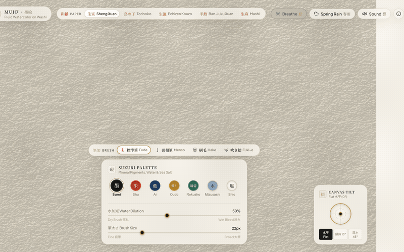
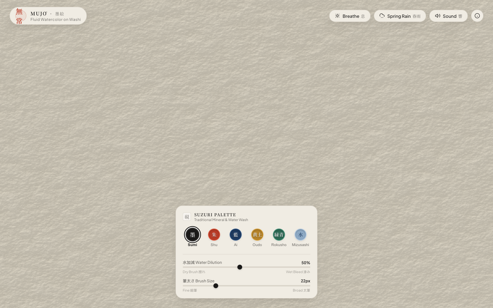

# MUJŌ (無常) — Meditative Watercolor on Washi



A physically-based digital watercolor engine running entirely on WebGPU compute shaders, simulating the ephemeral beauty of Japanese sumi-e ink on handmade washi parchment. Strokes bleed, diffuse through porous fibers, darken along edges, and gradually sublime back to pristine paper.

## Quick Start

```bash
git clone https://github.com/AndrewVoirol/watercolor-workbook.git
cd watercolor-workbook
npm install
npm run dev
```

*Requires Node.js ≥ 18 and a browser with WebGPU support (Chrome 113+, Edge 113+, Safari 18+).*

---

## App States

| Pristine Washi Parchment | Calligraphy & Fluid Blending | Physics & Aesthetics Guide |
| :---: | :---: | :---: |
|  |  |  |

---

## How It Works

### Interacting with the Canvas
1. **Choose an Authentic Japanese Brush (筆架 - Fudekake)**:
   - **Fude (標準筆)**: Classic round animal-hair brush for expressive calligraphic tapers, pressure flares, and live **Katabokashi (片ぼかし)** asymmetric pigment loading.
   - **Menso (面相筆)**: Ultra-fine slender sable liner for hairline precision, botanical veins, and delicate details.
   - **Hake (刷毛)**: Broad flat wooden wash brush for wide atmospheric washes and parallel bristle grooves (*kasure* 擦れ).
   - **Fuki-e (吹き絵)**: Traditional blown-ink splatter technique dispersing organic aerosol mist and satellite ink droplets.
2. **Choose an Authentic Mineral Pigment & Tools (硯 - Suzuri)**:
   - **Sumi (墨)**: Pure carbon black soot ink.
   - **Shu (朱)**: Radiant cinnabar vermilion.
   - **Ai (藍)**: Deep natural indigo.
   - **Oudo (黄土)**: Warm raw yellow ochre earth.
   - **Rokusho (緑青)**: Malachite mineral verdigris.
   - **Mizusashi (水)**: Clear water wash to blend, dilute, and re-mobilize wet pigment.
   - **Shio (塩)**: Coarse sea salt crystal dish for hygroscopic starburst granulation (*Shio-furi* 塩振り).
3. **Switch Authentic Washi Paper Varietals (和紙)**: Choose between five distinct procedural GPU heightmap, porosity, and fiber tensor structures:
   - **Sheng Xuan (生宣 - Raw Rice Paper)**: Unsized raw mulberry and bamboo paper with high capillary absorbency ($\theta_c \approx 25^\circ$). Wicks water rapidly via Lucas-Washburn absorption, creating soft bleeding halos (*nijimi* 滲み).
   - **Torinoko (鳥の子 - Sized Eggshell Washi)**: Smooth alum-gelatin sized (*dousa* 礬水) paper with high contact angle ($\theta_c \approx 78^\circ$). Resists penetration, yielding crisp calligraphic contour edges and glossy surface puddles.
   - **Echizen Kouzo (生漉楮紙 - Wild Mulberry)**: Heavy raw Kozo paper with long interwoven bast fibers. Deep physical tooth traps heavy pigment sediments (Oudo, Rokusho) while directional fiber tensor channels guide whisker tendril bleeding (*Hige-nijimi* 髭滲み).
   - **Ban-Juku Xuan (半熟宣 - Semi-Sized Xuan)**: Balanced sizing ratio (50% absorption, 50% surface dwell) providing controlled sumi-e wash shading and dual-tone Katabokashi strokes.
   - **Mashi (生麻紙 - Wild Hemp Washi)**: Ancient wild hemp paper with a prominent cross-hatch texture, high friction resistance, and rugged granulating tooth.
4. **Canvas Tilt & Gravity Flow (紙の傾き)**: Drag the 2D brass compass gimbal or tilt your mobile device (gyroscope) to watch wet watercolor puddles pool, bead up, and cascade downwards along paper fibers.
5. **Water Dilution (水加減)**: Dial down for dry brush (*kasure* 擦れ) fiber granulation, or dial up for lush wet bleeding (*nijimi* 滲み).
6. **Watermark Artist Seal (落款印 Rakkan-in)**: Traditional cinnabar watermark stamp that softly recedes during active painting strokes (*Ma* 間) and serenely returns during contemplative pauses.
7. **Breathe (息)**: Toggle preservation mode to suspend impermanence and freeze your painting in time.
8. **Spring Rain (春雨)**: Wash the parchment with gentle garden rain to soften and dissolve dry strokes into a mist.
9. **Sound (響)**: Immerse yourself in generative *shishi-odoshi* bamboo water droplets, resonant hollow bamboo brush knocks (*Take-oto* 竹音), earthenware inkstone thuds (*Tsuchi-oto* 土音), paper-specific brush friction acoustics, and crystalline salt sprinkles.

---

### Physical & Mathematical Simulation Architecture

#### 1. Coupled Two-Layer Hydrodynamic Mechanics
Water on the canvas is partitioned into two coupled layers:
- **Surface Free Water ($h_{surf}$)**: Governed by 2D shallow-water Navier-Stokes equations with Brinkman porous height-clearance drag:
  $$\frac{\partial \mathbf{u}}{\partial t} + (\mathbf{u} \cdot \nabla)\mathbf{u} = -\frac{1}{\rho}\nabla p + \nu \nabla^2 \mathbf{u} + \mathbf{g} - \mu_{drag} \max(0, 1 - \frac{h_{surf}}{h_{tooth}}) \mathbf{u}$$
- **Fiber Matrix Water ($h_{cap}$)**: Governed by Lucas-Washburn vertical imbibition and anisotropic porous Darcy tensor diffusion:
  $$\frac{dh_{cap}}{dt} = \frac{\gamma r_{pore} \cos\theta_c}{4 \mu h_{cap}}$$
  $$\mathbf{J}_{cap} = -\mathbf{K}_{tensor} \nabla h_{cap}, \quad \mathbf{K}_{tensor} = \mathbf{R}(\theta)\begin{pmatrix} K_\parallel & 0 \\ 0 & K_\perp \end{pmatrix}\mathbf{R}(-\theta)$$
  where $\theta(x,y)$ is the procedural Kozo/hemp fiber orientation angle field.

#### 2. Stokes Pigment Sedimentation & Coffee-Ring Pinning
Suspended pigment particles undergo continuous Stokes settling into microscopic paper valleys:
$$v_{sed} = \frac{2 r_p^2 (\rho_p - \rho_w) g}{9 \mu}$$
Heavy mineral pigments (Oudo $\rho \approx 2.8$, Rokusho $\rho \approx 4.0$) deposit deeply into the grain tooth, while capillary evaporation fluxes drive fine Sumi soot to pinning boundaries ($\nabla h_{surf}$), producing authentic dark perimeter rims.

#### 3. Hygroscopic Fiber Swelling & Dynamic 3D Paper Buckling (*Washi Hawa* 和紙たわみ)
Moisture absorbed into the paper fiber matrix expands cellulose fibers, dynamically distorting surface normals in real-time:
$$\mathbf{N}' = \text{normalize}\left(\mathbf{N} + \alpha_{buckle} \cdot h_{cap} \cdot \nabla h_{cap}\right)$$

#### 4. Refractive Index Matching Optical Wet-Darkening
When water ($n_{water} \approx 1.33$) fills the cellulose air voids ($n_{air} = 1.0 \to n_{cellulose} \approx 1.54$), internal Fresnel backscattering decreases exponentially:
$$S_{eff} = S \cdot \exp\left(-\beta \cdot h_{cap}\right)$$
This replicates the authentic visual darkening and translucent depth of freshly wetted washi paper before evaporation.

#### 5. 2-Flux Kubelka-Munk Spectral Radiative Transfer
Subtractive color compositing is calculated from physical absorption ($K$) and scattering ($S$) spectra:
$$R_\infty = 1 + \frac{K}{S} - \sqrt{\left(\frac{K}{S}\right)^2 + 2\left(\frac{K}{S}\right)}$$

---

## Tech Stack

| Component | Technology |
| :--- | :--- |
| **Compute & Graphics Engine** | WebGPU (Compute & Fragment WGSL Shaders) |
| **Language** | TypeScript |
| **Build & Dev Tool** | Vite |
| **Audio Synthesis** | Web Audio API (Generative Zen Soundscapes & Paper-Specific Acoustics) |
| **Styling** | Vanilla CSS (Karesansui Minimalist Design System) |

---

## License

MIT
